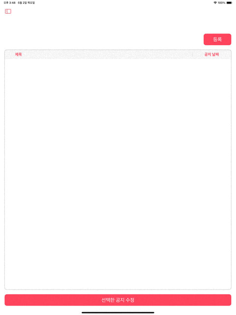

<center>


</center>

<br>

# Zz!Rit
만나는 순간의 짜릿함, Zz!Rit!
<br>
<br>

## 프로젝트 소개
### 개발기간
- 2024년 04월 03일(수) ~ 05일(금) <b>앱 기획</b>
- 2024년 04월 08일(월) ~ 11일(목) <b>프로토타입 개발</b>
- 2024년 04월 11일(목) ~ 05월 01일(화) <b>실 개발</b>
- 2024년 05월 01일(화) ~ 05월 03일(금) <b>발표 자료 및 영상 제작</b>


### 개발 및 테스트 환경 버전
- for Consumer
    - Xcode 15.3
    - Swift 5.10
    - iOS 16+
    - Portrait Only
    - LightMode Only
- for Administrator
    - Xcode 15.3
    - Swift 5.10
    - iOS 16+
    - LightMode Only
- Database
    - Xcode 15.3
    - Swift 5.10
    - Firebase 10.23.1
<br>

### 프로젝트 실행 방법
```
프로젝트 빌드 시 GoogleService-Info.plist, Secrets.configs 파일이 필요합니다.
위의 두 파일은 본 프로젝트 실행 시 06.mat_bluer@icloud.com으로 요청해주세요.

FirestoreDatabase 및 FirebaseStorage 생성 여부를 확인하세요.
```
- git clone
```
git clone https://github.com/APP-iOS4/zzrit
```
- 현재 브랜치가 main에 있는지 확인하십시오.
- [Consumer] Simulator 기기를 iPhone으로 설정하고 빌드합니다.
- [Administrator] Simulator 기기를 iPad로 설정하고 빌드합니다.
<br>

### 구현 목표
#### 소비자 앱
 - <b> 위치 기반 서비스를 통하여 자신의 위치와 모임의 위치를 비교할 수 있습니다. </b>

  |  |  | 
  |--|--|

<br>

 - <b> 사용자는 모임을 생성 및 참여를 할 수 있습니다. </b>

  |  |  |  |   |
  |--|--|--|--|

<br>

 - <b> 모임을 사용자의 취향에 맞게 탐색할 수 있습니다. </b>

  |  | 
  |--|

<br>

 - <b> 참여한 사용자와 채팅을 주고 받을 수 있습니다. </b>

  |  |  | 
  |--|--|

<br>

 - <b> 사용자는 자신의 프로필을 변경, 최근 본 모임, 문의, 로그아웃, 회원 탈퇴를 할 수 있습니다. </b>

 |  |  |  |  |  |
  |--|--|--|--|--|

<br>

 - <b> 모임 종료 시, 사용자는 다른 사용자를 투표할 수 있습니다. </b>

  |  |
  |--|

<br>

 - <b> 인앱 결제로 더욱 다양한 기능을 경험할 수 있으며, 푸시 알림을 통해 유저는 실시간 정보를 알 수 있습니다. </b>

  | |  |  |
  |--|--|--|


<br>

#### 관리자 앱
- ##### 관리자는 모임의 상태 및 유저의 정보를 가져와 관리를 할 수 있습니다.
 
  | |  |
  |--|--|

  |  |  |  |
  |--|--|--|

<br>

- ##### 관리자가 소비자앱 사용자에게 공지사항, 문의내역을 보낼 수 있으며, 이용약관 등을 수정할 수 있습니다.

  |  |  |  |
  |--|--|--|

<br>

<!--

|담당자|구현내용|
|:---:|:---:|
|누구누구|뭘 하셨나요?|
|누구누구|뭘 하셨나요?|
|누구누구|뭘 하셨나요?|
|누구누구|뭘 하셨나요?|
|누구누구|뭘 하셨나요?|
|누구누구|뭘 하셨나요?|
|누구누구|뭘 하셨나요?|

<br>
-->
<br>

## 팀원소개
### We are Avengers
|담당|역할|담당자||한줄 소감|
|:---:|:---:|:---:|:---:|:---|
|모델|PM|정재웅<br>[@jjw8959](https://github.com/jjw8959)||눈코뜰새 없이 너무나도 바쁜 한달이었습니다. 여러분 어딜가시던 번창하십쇼!|
|관리자|팀장|강건<br>[@kangsworkspace](https://github.com/kangsworkspace)||리릿이는 이제 보내줄때가 되었다...|
|소비자||김예지<br>[@nxtlevYeah](https://github.com/nxtlevYeah)||다들 행복하슈크림 요즘 너무비싸.|
|모델||박상현<br>[@iosHumhae](https://github.com/iosHumhae)||새로운 기술을 접해볼 수 있어 재미있는 프로젝트였고, 향후 다른 프로젝트를 진행하더라도 이번 프로젝트를 발판삼아 어떻게든 구현할 수 있겠다는 자신감을 얻게 되었습니다.|
|소비자|팀장|이선준<br>[@SunJuneL](https://github.com/SunJuneL)|| 다들 지금까지 너무 고생 많았습니다. 개발자의 길을 포기하지 않고, 사회에서 만날 수 있었으면 좋겠습니다.|
|관리자||이우석<br>[@wl00ie19](https://github.com/wl00ie19)||모바일 앱 개발과 관련된 경험이 거의 없어 미흡한 점들도 많았으나, 다른 팀원 분들과 같이 작업하며 협업하는 능력과 부족한 앱 개발 능력을 키울 수 있었습니다. 모두 고생 많으셨습니다~!|
|소비자||하윤호<br>[@Hayunho](https://github.com/Hayunho)||다들 1달 동안 정말 고생이 많으셨습니다.|

<br>
<br>

## Notice
- 앱 내의 이미지 관련하여 아래 이메일로 문제를 제기해주시면, 확인 후 즉각 조치하도록 하겠습니다.
```
06.mat_bluer@icloud.com
```
<br>

## License
Copyright Techit iOS AppSchool 4, <b>Team Project4 Missing E</b>. All rights reserved.

License under the MIT license.
